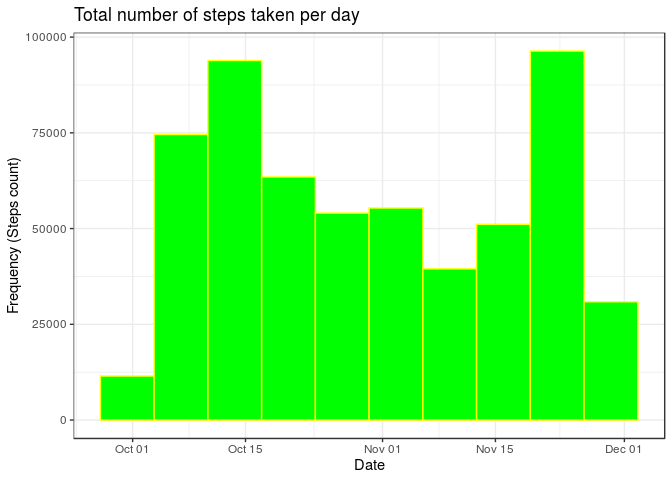
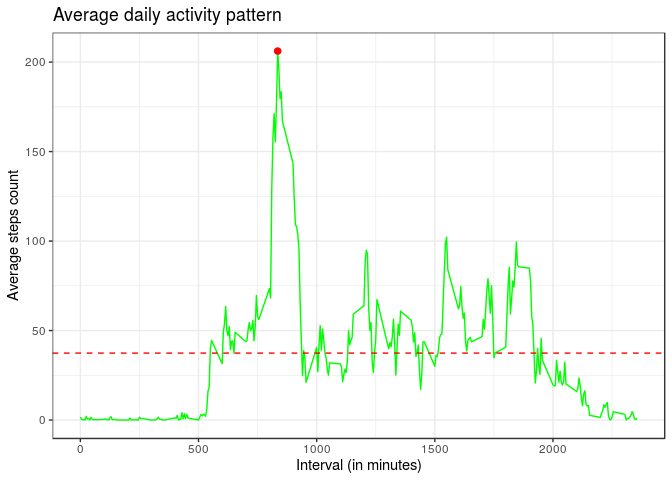
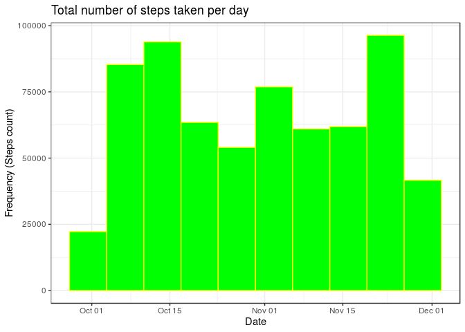
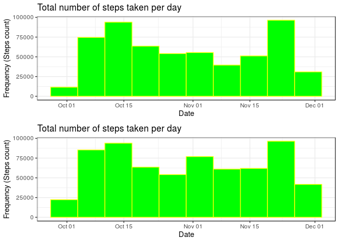
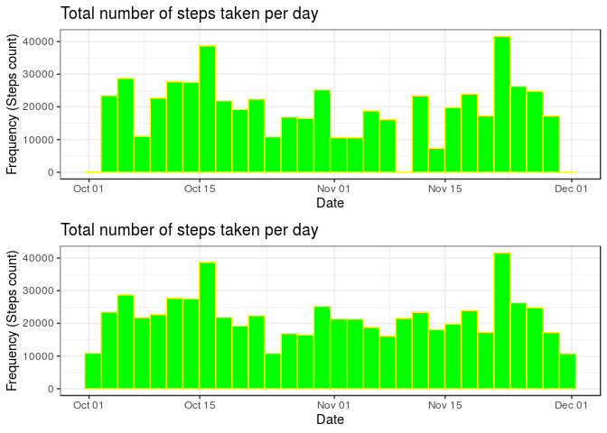
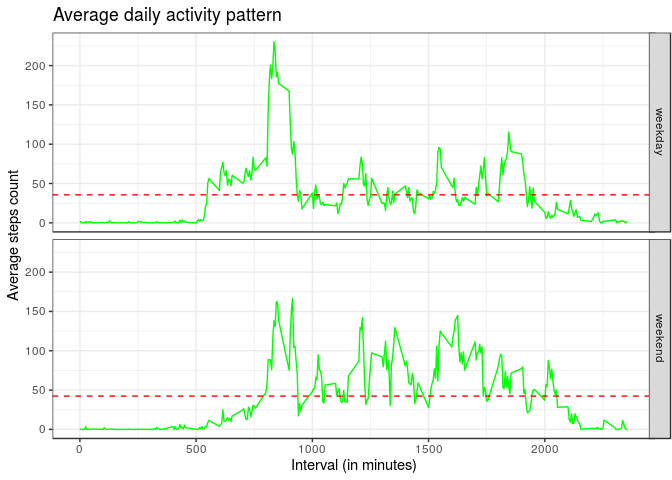

## Dataset description

This assignment makes use of data from a personal activity monitoring device. This device collects data at 5 minute intervals through out the day. The data consists of two months of data from an anonymous individual collected during the months of October and November, 2012 and include the number of steps taken in 5 minute intervals each day.

The dataset used here is the [Activity monitoring data]("https://d396qusza40orc.cloudfront.net/repdata%2Fdata%2Factivity.zip")

The variables included in this dataset are:

- **steps**: Number of steps taking in a 5-minute interval (missing values are coded as NA 
- **date**: The date on which the measurement was taken in YYYY-MM-DD format 
- **interval**: Identifier for the 5-minute interval in which measurement was taken 

The dataset is stored in a comma-separated-value (CSV) file and there are a total of 17,568 observations in this dataset.

## Loading and preprocessing the data

### Loading required packages


```r
suppressWarnings(suppressMessages(
    sapply(c("data.table", "dplyr", "ggplot2","gridExtra"), require, character.only=T,quietly=T)
    ))
```

```
## data.table      dplyr    ggplot2  gridExtra 
##       TRUE       TRUE       TRUE       TRUE
```

### Checking for the dataset and downloading


```r
#getting current directory's location
currentWD <- getwd()
zipfileName <- "repdata_data_activity.zip"

#download and unzipping dataset if it's not present in the same directory as this R script.
if(!"activity.csv"  %in% dir(path = currentWD, full.names = F, recursive = F)){
    if(zipfileName %in% dir(path = currentWD, full.names = F, recursive = F)){
        print("Unzipping to get the .csv file..")
        unzip(zipfile = file.path(currentWD,zipfileName))
    }else{
        print("Downloading dataset...")
        datasetURL <- "https://d396qusza40orc.cloudfront.net/repdata%2Fdata%2Factivity.zip"
        datasetFile <- download.file(datasetURL, destfile = file.path(currentWD, zipfileName) ,method = "curl")
        unzip(zipfile = file.path(currentWD, zipfileName))
        print("Dataset downloaded and unzipped...")
    }
}
```

### Loading data


```r
#using fread to reduce file read time
f1 <- fread("activity.csv", colClasses = c("","Date",""))
str(f1)
```

```
## Classes 'data.table' and 'data.frame':	17568 obs. of  3 variables:
##  $ steps   : int  NA NA NA NA NA NA NA NA NA NA ...
##  $ date    : Date, format: "2012-10-01" "2012-10-01" ...
##  $ interval: int  0 5 10 15 20 25 30 35 40 45 ...
##  - attr(*, ".internal.selfref")=<externalptr>
```

## What is mean total number of steps taken per day?

### Calculate the total number of steps taken per day

The data is grouped by date and the sum of steps taken per day is calculated. The missing values are ignored/removed.


```r
q1 <- f1 %>% 
    group_by(date) %>%
    summarise(sumSteps = sum(steps, na.rm = T))
head(q1)
```

```
## # A tibble: 6 x 2
##   date       sumSteps
##   <date>        <int>
## 1 2012-10-01        0
## 2 2012-10-02      126
## 3 2012-10-03    11352
## 4 2012-10-04    12116
## 5 2012-10-05    13294
## 6 2012-10-06    15420
```

### A histogram of the total number of steps taken each day


```r
#a histogram function to reuse
histo <- function(dat, binCount){
#y-axis denotes the frequency count ( the number of steps taken )
#x-axis contains the variable date, which is observed with this histogram
  ggplot(dat)+
        geom_histogram(aes(date, weight= sumSteps), fill="green",color= "yellow",bins = binCount)+
        labs(title="Total number of steps taken per day",
             x="Date",
             y="Frequency (Steps count)")+
        theme_bw()
}
histo(q1,binCount=10)
```

<!-- -->

### Calculate and report the mean and median of the total number of steps taken per day

```r
#mean and median of total number of steps per day
cat("Mean of total number of steps per day=", ceiling(mean(q1$sumSteps, na.rm = T)), "\nMedian of total number of steps per day=", median(q1$sumSteps, na.rm = T))
```

```
## Mean of total number of steps per day= 9355 
## Median of total number of steps per day= 10395
```

```r
#mean and median of number of steps taken per day; removing steps equal to 0 and NA
q1.1 <- f1 %>%
    filter(!is.na(steps) & steps>0) %>%
    group_by(date) %>%
    summarise_at(.vars =  vars(steps), .funs = list(meanSteps = "mean",medianSteps="median"), na.rm=T)
head(q1.1)
```

```
## # A tibble: 6 x 3
##   date       meanSteps medianSteps
##   <date>         <dbl>       <dbl>
## 1 2012-10-02       63         63  
## 2 2012-10-03      140.        61  
## 3 2012-10-04      121.        56.5
## 4 2012-10-05      155.        66  
## 5 2012-10-06      145.        67  
## 6 2012-10-07      102.        52.5
```

## What is the average daily activity pattern?

### Make a time series plot (i.e. type = "l") of the 5-minute interval (x-axis) and the average number of steps taken, averaged across all days (y-axis)

```r
#average number of steps taken, averaged across all days for a 5-minute interval
q2 <- f1 %>% group_by(interval) %>% summarise(meanSteps = mean(steps, na.rm = T))

q2.1 <- as.numeric(q2[which.max(q2$meanSteps), ])

#plotting the time-series plot
timeseries1 <- ggplot(q2, aes(interval,meanSteps))+
                geom_line(color="green")+
                geom_hline(yintercept = mean(q2$meanSteps), color="red", lty=2)+
                labs(title="Average daily activity pattern",
                     x="Interval (in minutes)",
                     y="Average steps count")+
                annotate("point",x=q2.1[1], y=q2.1[2], color="red", size=2)+
                theme_bw()
timeseries1
```

<!-- -->

### Which 5-minute interval, on average across all the days in the dataset, contains the maximum number of steps?

```r
cat("5-min interval containing the maximum number of steps is", q2.1[1], "with step count", round(q2.1[2],0))
```

```
## 5-min interval containing the maximum number of steps is 835 with step count 206
```

## Imputing missing values

### Calculate and report the total number of missing values in the dataset (i.e. the total number of rows with NA)


```r
#number of missing entries column wise
colSums(is.na(f1))
```

```
##    steps     date interval 
##     2304        0        0
```

### Devise a strategy for filling in all of the missing values in the dataset

#### Strategy : Using the mean of the 5-minute interval across all days to fill NA values
The mean of the 5-minute interval across all days can be used to fill in the missing values, as it's safer to assume the subject has walked the average step count at the same interval each day.

```r
f1.copy <- f1

#for grouping by interval and calculating the mean of 5-min interval,variable q2 is used.
head(q2)
```

```
## # A tibble: 6 x 2
##   interval meanSteps
##      <int>     <dbl>
## 1        0    1.72  
## 2        5    0.340 
## 3       10    0.132 
## 4       15    0.151 
## 5       20    0.0755
## 6       25    2.09
```

```r
#getting the ids of missing steps in the dataset
f1.id <- which(is.na(f1.copy$steps))

#missing values subset
f1.na <-f1.copy[f1.id,]

#merging based on interval; now instead of NA steps, the meanSteps column can be used to fill the missing values
f1.copy$steps[f1.id] <- inner_join(f1.na, q2, by="interval")$meanSteps

colSums(is.na(f1.copy))
```

```
##    steps     date interval 
##        0        0        0
```


### Create a new dataset that is equal to the original dataset but with the missing data filled in.

```r
#creating datasets from both the strategies used
fwrite(f1.copy, file = "activity_filled_intervalMean.csv")
```

### Make a histogram of the total number of steps taken each day and Calculate and report the mean and median total number of steps taken per day.

```r
#calculating the total number of steps taken per day based on the new dataset
q3 <- f1.copy %>% 
    group_by(date) %>%
    summarise(sumSteps = sum(steps, na.rm = T))

#y-axis denotes the frequency count ( the number of steps taken )
#x-axis contains the variable date, which is observed with this histogram
histo(dat = q3, binCount = 10)
```

<!-- -->

```r
#mean and median of total number of steps per day
cat("Mean of total number of steps per day=", ceiling(mean(q3$sumSteps, na.rm = T)),
    "\nMedian of total number of steps per day=", ceiling(median(q3$sumSteps, na.rm = T)))
```

```
## Mean of total number of steps per day= 10767 
## Median of total number of steps per day= 10767
```

```r
#mean and median of number of steps taken per day; removing steps equal to 0 and NA
q3.1 <- f1.copy %>%
    filter(steps>0)%>%
    group_by(date) %>%
    summarise_at(.vars =  vars(steps), .funs = list(meanSteps = "mean",medianSteps="median"), na.rm=T)
head(q3.1)
```

```
## # A tibble: 6 x 3
##   date       meanSteps medianSteps
##   <date>         <dbl>       <dbl>
## 1 2012-10-01      40.0        37.5
## 2 2012-10-02      63          63  
## 3 2012-10-03     140.         61  
## 4 2012-10-04     121.         56.5
## 5 2012-10-05     155.         66  
## 6 2012-10-06     145.         67
```

### Do these values differ from the estimates from the first part of the assignment? What is the impact of imputing missing data on the estimates of the total daily number of steps?

Yes, the average number of steps taken by person has changed and the values can be checked below. On the comparison with the two histograms, the change can be seen clearly. The gaps in histogram when number of bins set to 30 are no longer present.


```r
data.frame(Mean=c(mean(q1$sumSteps), mean(q3$sumSteps)),
           Median=c(median(q1$sumSteps), median(q3$sumSteps)), 
           row.names = c("With NA", "NA removed"))
```

```
##                Mean   Median
## With NA     9354.23 10395.00
## NA removed 10766.19 10766.19
```

```r
cat("Comparison of two histograms (Before and After NA removal)")
```

```
## Comparison of two histograms (Before and After NA removal)
```

```r
grid.arrange(histo(q1,10), histo(q3,10))
```

<!-- -->

```r
cat("Comparison of two histograms with bin count set to 30 (Before and After NA removal)")
```

```
## Comparison of two histograms with bin count set to 30 (Before and After NA removal)
```

```r
grid.arrange(histo(q1,30), histo(q3,30))
```

<!-- -->

## Are there differences in activity patterns between weekdays and weekends?

### Create a new factor variable in the dataset with two levels – “weekday” and “weekend” indicating whether a given date is a weekday or weekend day.
The filled-in dataset `f1.copy` is used.

```r
f1.copy.cat <- f1.copy
f1.copy.cat$cat <- "weekday"
f1.copy.cat[which(weekdays(f1.copy.cat$date) %in% c("Saturday","Sunday"))]$cat <- "weekend" 
#number of weekdays and weekends
table(f1.copy.cat$cat)
```

```
## 
## weekday weekend 
##   12960    4608
```

### Make a panel plot containing a time series plot (i.e. type = "l") of the 5-minute interval (x-axis) and the average number of steps taken, averaged across all weekday days or weekend days (y-axis).

From the plots, we can observe that subjects tend to move more in weekend during intervals 1000-1800 on the other hand, the peak value is higher in the case of weekdays.

```r
q4 <- f1.copy.cat %>% group_by(interval,cat) %>% summarise(meanSteps = mean(steps, na.rm = T))
head(q4)
```

```
## # A tibble: 6 x 3
## # Groups:   interval [3]
##   interval cat     meanSteps
##      <int> <chr>       <dbl>
## 1        0 weekday    2.25  
## 2        0 weekend    0.215 
## 3        5 weekday    0.445 
## 4        5 weekend    0.0425
## 5       10 weekday    0.173 
## 6       10 weekend    0.0165
```

```r
hline.data_q4 <- data.frame(cat=c("weekday","weekend"),
                        mean=c(
                                mean(q4$meanSteps[q4$cat=="weekday"]),
                                mean(q4$meanSteps[q4$cat=="weekend"])
                            ))
hline.data_q4
```

```
##       cat     mean
## 1 weekday 35.61058
## 2 weekend 42.36640
```

```r
timeseries2 <- ggplot(q4, aes(interval,meanSteps))+
                facet_grid(facets = cat~.)+
                geom_line(color="green")+
                labs(title="Average daily activity pattern",
                     x="Interval (in minutes)",
                     y="Average steps count")+
                geom_hline(data = hline.data_q4, aes(yintercept =mean),color="red", lty=2 )+
                theme_bw()

timeseries2
```

<!-- -->

